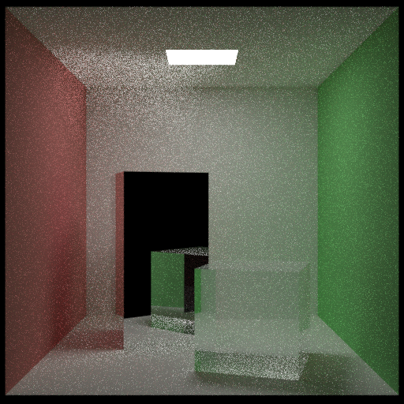

# MCRT
A Monte Carlo Raytracer. Rays bounce around randomly and return physically plausible color to the pixels.

Path tracing (100 spp)

Bidirectional Path Tracing (effectively 100 spp)

# Building

The project can be built with CMake. External dependencies such as GLM and NanoRT are included, and optional ones such as Embree can be found by specifying their installing directories to the cmake command.